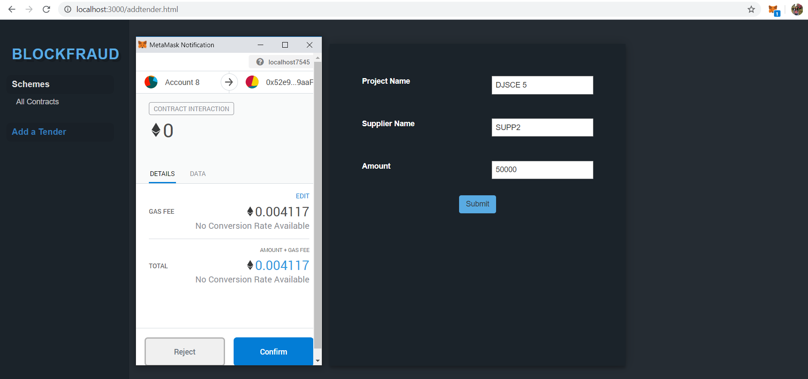
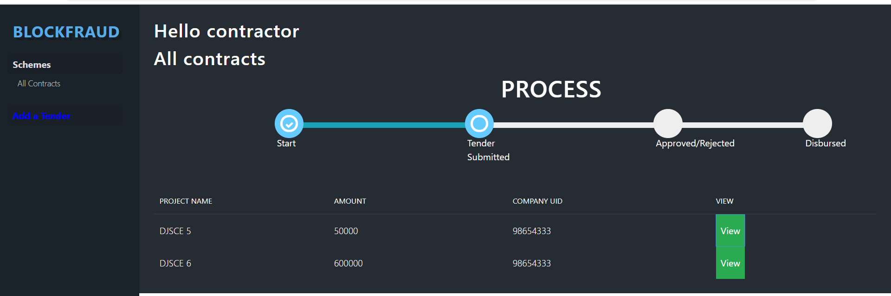
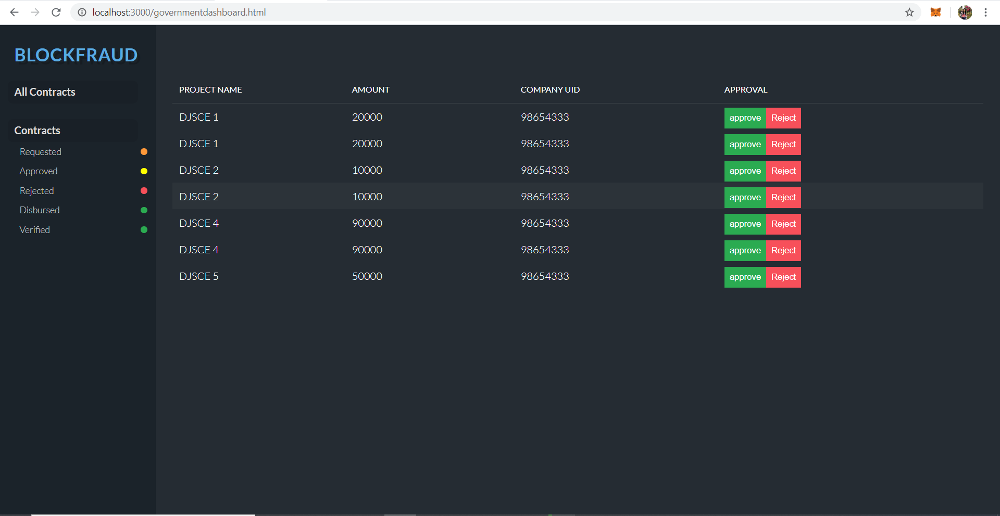
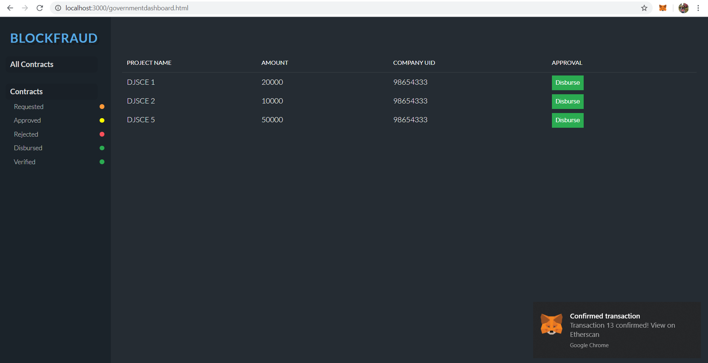
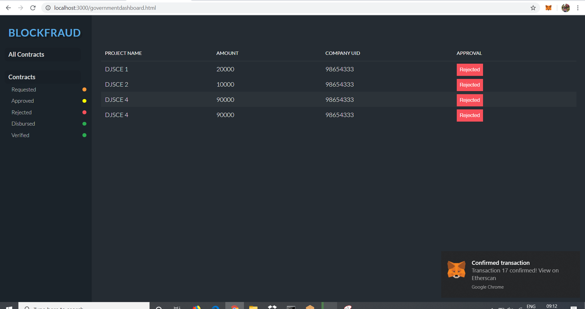

# BlockFraud
Blockchain DApp made in CodeShashtra 6.0  
Blockchain Solution for Transparent and Speedy Disbursement of Government funds for various schemes.  
Different Beneficiaries such as contractors can make use of this Dapp for tender application, 
faster approval, and fund disbursal process. At the same time, the government is facilitated
to track the entire monetary transactions between the contractors and the suppliers.
The scope of this project can be increased to other schemes such as student scholarship, financial aids to farmers, etc.  

Some snaps:  
Contractor adds a new construction project to apply for government fund.  
    
All project money requests are visible to constructor and he can view live tracking of his request on his homepage.  
   
Government can either approve or reject his tender(request) after verfication.  
      
After approval government can choose to disburse the asked money to contractor when available.  
      
All rejected tenders are also kept to keep track of previous rejected tendors.
      

After disbursal of money, it is mandatory for constructor to submit verification form which includes UTR number of payment to supplier and supplier information. This is where blockchain is useful. Government can later verify the immutable blockchain history of project for investigation  
  (Further screenshots will be added soon)....
